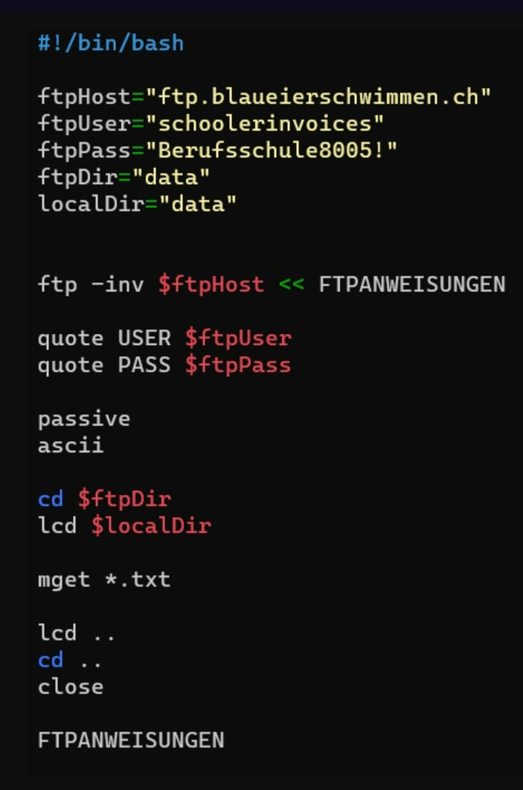

# Beschreibung
Hier werde ich in kurzen schritten beschreiben was alles an know how und Vorbereitung erarbeitet werden muss.  
Ebenfalls werde ich einzelne schritte beschreiben, welche für die Handhabung genutzt werden sollten. 

## Schritte

1. Man muss sich mit einer FTP Verbindung an den Server verbunden haben.  

**Anleitung**

2. Nach der Verbindung zum Server muss nun das Skript im Home Verzeichnis per ./ausgeführt werden. 

3. Was dieses Skript nun macht ist folgendes:
* Eine Datei mit der neusten Lautstärke deren Datum und Uhrzeit erstellen und nachtragen.
* Eine Umrechnung der Dateien zu Integer.
* Mit der Umrechnung nun eine Auflistung zwischen, zu lauten und angemessenen Lautstärken machen
* Jeden Morgen um 8 Uhr das Skript ausführen.

4. zu installieren ist der Service cronjob was ermöglicht eine Automatisierung einzurichten 

5. Idealer weise wäre natürlich noch eine Datei die anzeigt wann das Letzte mal zu Laut war und so kontrollierbar wann die Lautstärke anzupassen ist. 

